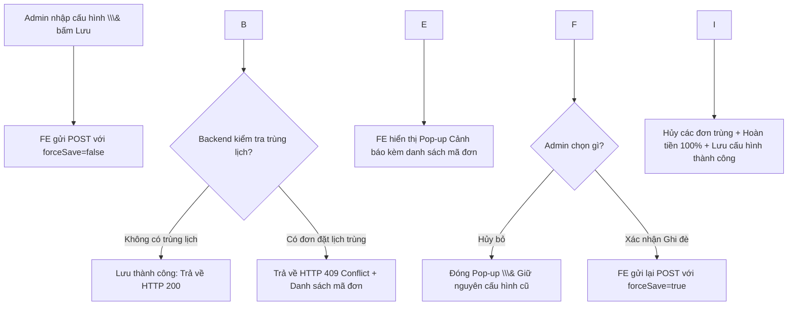

# HƯỚNG DẪN TÍCH HỢP FRONTEND (FE INTEGRATION GUIDE)

Tài liệu này hướng dẫn lập trình viên Frontend (FE) tích hợp các API mới nâng cấp ở Backend liên quan đến:

1. **Quy tắc Hủy lịch \& Đi trễ (Phần 3)**.
2. **Cơ chế Cảnh báo \& Ghi đè (Warning \& Force Save) khi Admin cấu hình ngày mai**.

\---

## 1\. TÍCH HỢP QUY TẮC HỦY LỊCH \& ĐI TRỄ

Backend đã áp dụng các quy tắc tài chính tự động khi Hủy lịch hoặc Check-in trễ:

### A. Luồng Hủy Lịch (Cancel Booking)

* **API Endpoint**: `POST /api/customer/bookings/{id}/cancel`
* **Quy tắc hiển thị/xử lý ở FE**:

  * FE gửi yêu cầu hủy bình thường.
  * **Trường hợp hủy sớm (trước giờ hẹn $\\ge$ 60 phút)**: Hệ thống tự động hoàn tiền 100% vào Ví điện tử của khách. FE hiển thị thông báo thành công: *"Hủy lịch thành công. Tiền đặt cọc (100%) đã được hoàn lại vào ví của bạn."*
  * **Trường hợp hủy trễ (dưới 60 phút)**: Khách hàng sẽ bị phạt 100% tiền cọc (không hoàn tiền). FE nên hiển thị một cảnh báo trước khi khách bấm Hủy: *"Bạn đang hủy lịch sát giờ hẹn (dưới 60 phút). Bạn sẽ không được hoàn trả lại tiền cọc. Bạn có chắc chắn muốn hủy không?"*

### B. Luồng Check-in bằng QR tại quầy (Staff / Quầy quét QR)

* **API Endpoint**: `POST /api/customer/bookings/checkin-qr?qrContent=...`
* **Quy tắc xử lý lỗi**:

  * Nếu khách hàng đến trễ quá 15 phút so với giờ hẹn (`scheduledStartTime + 15 phút`), Backend sẽ tự động hủy lịch, hoàn tiền 80% (phạt 20%) và trả về lỗi **`HTTP 400 Bad Request`**.
  * **Response Error Body**:

&#x20;   `json { "status": 400, "message": "Lịch hẹn đã bị hủy tự động do bạn đến trễ quá 15 phút. Hệ thống đã hoàn lại 80% số tiền vào ví của bạn." } `

* FE cần hiển thị thông báo lỗi này trên màn hình quét QR để nhân viên/khách hàng nắm thông tin.

\---

## 2\. API ADMIN CẬP NHẬT CẤU HÌNH VẬN HÀNH (WARNING \& FORCE SAVE)

Khi Admin cấu hình khung giờ hoạt động của ngày mai, có thể xảy ra trường hợp các lịch hẹn đã đặt trước đó bị rơi ra ngoài khung giờ mới. Chúng ta áp dụng cơ chế **Cảnh báo \& Xác nhận ghi đè** như sau:

### API Endpoint:

* **Method**: `POST`
* **URL**: `/api/admin/operations/config-tomorrow`
* **Headers**:

  * `Content-Type: application/json`
  * `Authorization: Bearer <token\\\_admin>`
* **Request Body**:

```json
  {
    "openTime": "10:00",
    "slotCount": 5,
    "bayCount": 2,
    "forceSave": false
  }
  ```

\---

### KỊCH BẢN TÍCH HỢP TRÊN GIAO DIỆN ADMIN (UX FLOW)



#### Bước 1: Gửi yêu cầu kiểm tra trước (`forceSave: false` hoặc không truyền)

Khi Admin nhấn nút **"Lưu cấu hình"**, FE gửi request với body:

```json
{
  "openTime": "10:00",
  "slotCount": 5,
  "bayCount": 2
}
```

#### Bước 2: Xử lý phản hồi từ Backend

* **Trường hợp 1: Thành công (Không có đơn nào bị xung đột)**

  * Backend trả về `HTTP 200 OK`.
  * FE thông báo cập nhật thành công và đóng form.
* **Trường hợp 2: Thất bại do Xung đột (Có đơn đặt lịch bị ảnh hưởng)**

  * Backend trả về mã lỗi **`HTTP 409 Conflict`**.
  * Định dạng thông báo lỗi ở trường `message` hoặc `reason` sẽ có tiền tố **`CONFLICT:`** theo sau là danh sách mã đơn cách nhau bằng dấu phẩy.
  * **Ví dụ Response Error**:

&#x20;   `json { "status": 409, "message": "CONFLICT:BK-E23AB981,BK-F992AB12" } `

* **FE cần làm**:

  1. Parse chuỗi mã đơn từ chuỗi lỗi (cắt bỏ chữ `CONFLICT:` và `split(",")` để lấy mảng các mã đơn: `\\\["BK-E23AB981", "BK-F992AB12"]`).
  2. Hiển thị một **Pop-up Cảnh báo (Warning Dialog)**:

> ⚠️ \\\*\\\*Cảnh báo xung đột lịch hẹn!\\\*\\\*
       >
       > Ngày mai hiện đang có \\\*\\\*2 đơn đặt lịch\\\*\\\* nằm ngoài khung giờ hoạt động mới bạn vừa chọn:
       > \\\* \\\*\\\*BK-E23AB981\\\*\\\*
       > \\\* \\\*\\\*BK-F992AB12\\\*\\\*
       >
       > Nếu bạn tiếp tục lưu cấu hình này, hệ thống sẽ \\\*\\\*tự động hủy các đơn đặt lịch trên và hoàn lại 100% tiền cọc\\\*\\\* vào ví của khách hàng.
       > 
       > Bạn có muốn tiếp tục lưu và ghi đè không?
       > 
       > `\\\[ Hủy Bỏ ]` `\\\[ Tiếp Tục Lưu \\\& Hủy Đơn ]`

&#x20;   3. Nếu Admin bấm \*\*"Hủy Bỏ"\*\*: Đóng Pop-up, không lưu cấu hình.
    4. Nếu Admin bấm \*\*"Tiếp Tục Lưu \\\& Hủy Đơn"\*\*: FE gửi lại chính xác Request đó nhưng thêm tham số `"forceSave": true`:


```json
       {
         "openTime": "10:00",
         "slotCount": 5,
         "bayCount": 2,
         "forceSave": true
       }
       ```

    5. Backend xử lý hủy các lịch hẹn xung đột, hoàn tiền vào ví khách, lưu cấu hình thành công và trả về `HTTP 200 OK`. FE thông báo lưu thành công.


